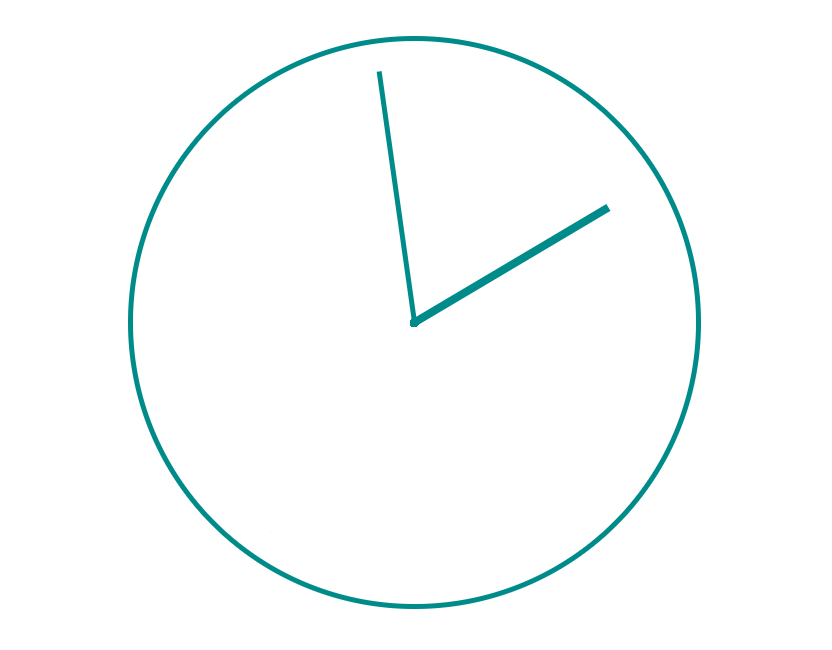
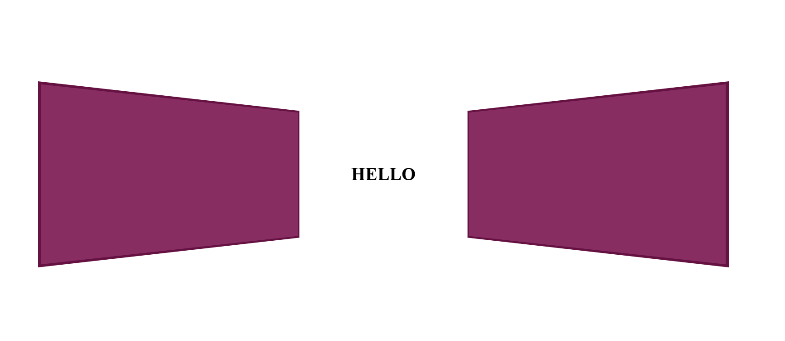
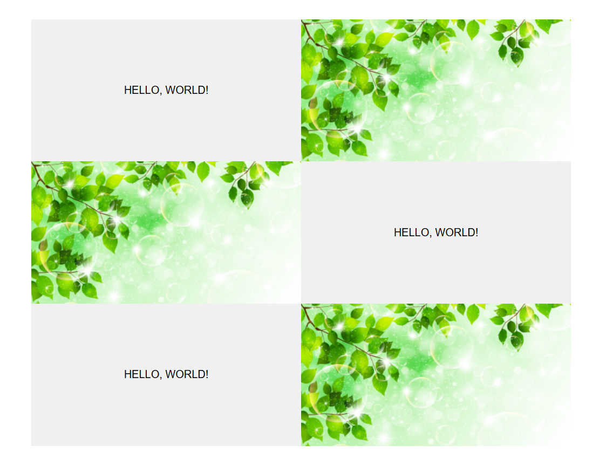

### Задание 1

Реализовать html-страницу с часами.
При открытии страницы стрелки часов должны двигаться 
бесконечно. Минутная стрелка должна двигаться быстрее, чем часовая стрелка.

---

### Задание 2

Реализовать html-страницу со створками.
Изначально на странице отображаются два одинаковых блока, за которыми спрятан текст. При наведении мышкой на любой 
из блоков они медленно (за 2 секунды) раскрываются так, чтобы был виден текст. Если мышку увести,то все резко возвращается к первоначальному состоянию.

---

### Задание 3

Реализовать html-страницу с несколькими блоками текст + 
картинка.

Требования:

 ■ блок состоит из текста и картинки, которые делят доступ
ную ширину поровну;

 ■ блок должен быть фиксированной высоты;

 ■ текст должен находиться посередине своей части;

 ■ картинка должна занимать всю свою часть по ширине и 
высоте;

 ■ картинка не должна выходить за пределы своей части;

 ■ при наведении мышкой на блок (текст + картинка):

 • он должен полностью покрыться полупрозрачной черной 
плашкой за 0.3 секунды;

 • картинка должна плавно (за 1 секунду) увеличиться, но 
при этом не выйти за пределы своей части.

---